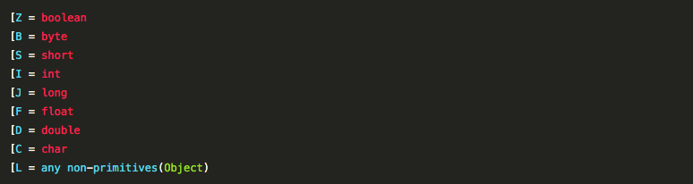

### 一些基本类型数组的Class表示




### getName(), getCanonicalName() 和getSimpleName()的区别

```java
public class ExternalClassConfig {
 
	private String desc;
 
	//    ...
    
    public static class InternalConfig {
    	//      ...
    }
 
    
}

@Test
public void testclassName() {
	System.out.println();
    // 外部类表示
    // getName()
	System.out.println("getName            " + ExternalClassConfig.class.getName());
    // getCanonicalName()
	System.out.println("getCanonicalName   " + ExternalClassConfig.class.getCanonicalName());
    // getSimpleName()
	System.out.println("getSimpleName      " + ExternalClassConfig.class.getSimpleName());
	
    // 内部类表示
    // getName()
	System.out.println("getName            " + InternalConfig.class.getName());
	// getCanonicalName()
    System.out.println("getCanonicalName   " +InternalConfig.class.getCanonicalName());
	// getSimpleName()
    System.out.println("getSimpleName      " +  InternalConfig.class.getSimpleName());
	
	System.out.println();
}
```
**输出结果**     

| 方法             | 值                                                  |
| ---------------- | --------------------------------------------------- |
| getName          | my.ExternalClassConfig                              |
| getName          | my.ExternalClassConfig$InternalConfig // 虚拟机表示 |
| getCanonicalName | my.ExternalClassConfig                              |
| getCanonicalName | my.ExternalClassConfig.InternalConfig // 更清晰表示 |
| getSimpleName    | ExternalClassConfig                                 |
| getSimpleName    | InternalConfig // 类名                              |

主要区别在表示数组的时候

| 方法             | 值                                      |
| ---------------- | --------------------------------------- |
| getName          | [Ljava.lang.String // 前面JNI字段描述符 |
| getCanonicalName | java.lang.String[]                      |
| getSimpleName    | String[]                                |


### 浅拷贝和深拷贝区别

- 浅拷贝 浅拷贝是按位拷贝对象，**它会创建一个新对象，这个对象有着原始对象属性值的一份精确拷贝**。如果属性是基本类型，拷贝的就是基本类型的值；如果属性是内存地址（引用类型），拷贝的就是内存地址 ，因此如果其中一个对象改变了这个地址，就会影响到另一个对象。
- 深拷贝 **深拷贝会拷贝所有的属性,并拷贝属性指向的动态分配的内存**。当对象和它所引用的对象一起拷贝时即发生深拷贝。深拷贝相比于浅拷贝速度较慢并且花销较大。 现在为了要在clone对象时进行深拷贝， 那么就要Clonable接口，覆盖并实现clone方法，除了调用父类中的clone方法得到新的对象， 还要将该类中的引用变量也clone出来。**如果只是用Object中默认的clone方法，是浅拷贝的**。