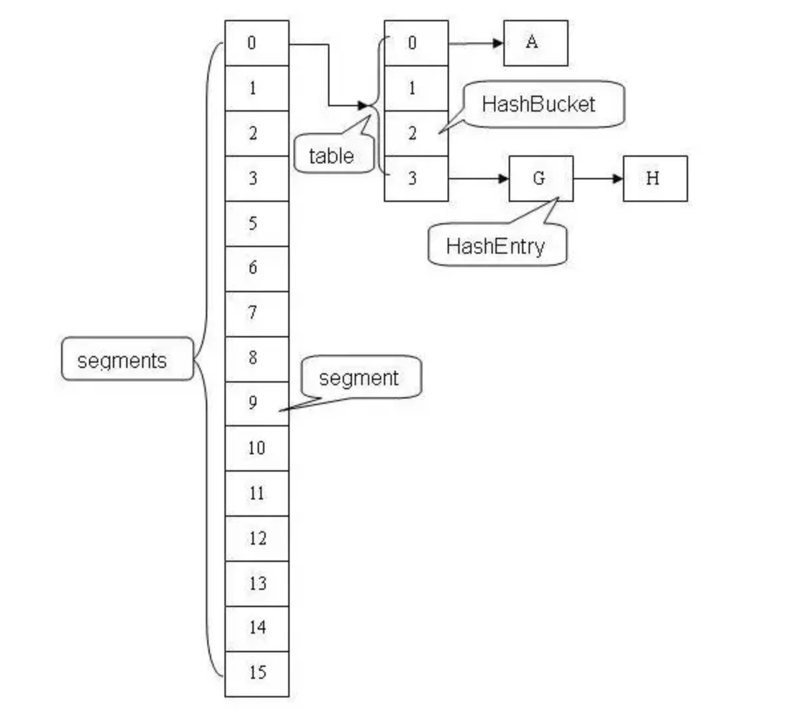

## ConcurrentHashMap

线程安全，利用了**锁细化**的优化技术。

1.8之前，使用了一个segments，每次存储选中一个segment，并对其加锁，这样避免了对整个map进行加锁。

1.8中，ConcurrentHashMap取消了segment分段锁，而采用**CAS和synchronized**来保证并发安全。底层结构也换成了类似HashMap的结构，**Node<K,V>数组+链表/红黑二叉树（如果链表长度达到8，则升级为红黑树）**。

首先每次插入找到要插入的node位置，**如果没发现头结点（没hash冲突），则使用cas插入**，如果失败（别的线程正好插入），则使用synchronized获得头结点锁，再插入。

### 如何计算size

在 JDK1.7 中，第一种方案他会使用不加锁的模式去尝试多次计算 ConcurrentHashMap 的 size，最多三次，**比较前后两次计算的结果，结果一致就认为当前没有元素加入**，计算的结果是准确的。 第二种方案是如果第一种方案不符合，他就会**给每个 Segment 加上锁，然后计算 ConcurrentHashMap 的 size 返回**。

## 拓展

### 红黑树

五个性质

1. 每个结点要么是红的要么是黑的。  
2. 根结点是黑的。  
3. 每个叶结点（叶结点即指树尾端NIL指针或NULL结点）都是黑的。  
4. 如果一个结点是红的，那么它的两个儿子都是黑的。  
5.  对于任意结点而言，其到叶结点树尾端NIL指针的每条路径都包含相同数目的黑结点。 