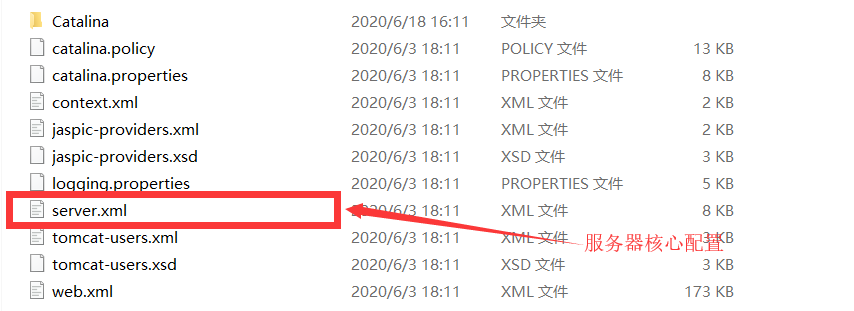
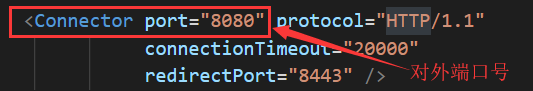

## Tomcat文件目录结构

常见的目录用处如下

- bin：启动和停止脚本
- conf：tomcat配置，包含server.xml、web.xml
- lib：依赖的jar包
- logs：日志目录
- webapps：web应用放置的位置


## 配置



在server.xml中可以配置访问的端口号、域名、web应用存放位置。

- 配置启动的端口号
	
- 配置域名和web应用存放位置

  


## 网站发布

一个web应用放置到webapss下的目录基本结构应该如下：

```
--webapps:
	-your_webapp:
		-WEB-INF
			-classes：编译后的java文件
			-lib：依赖的jar包
			-web.xml：配置文件，包含一些servlet映射
		-index.html/index.jsp/...
		-static
			-css
			-js
			-img
			-...
		
```

