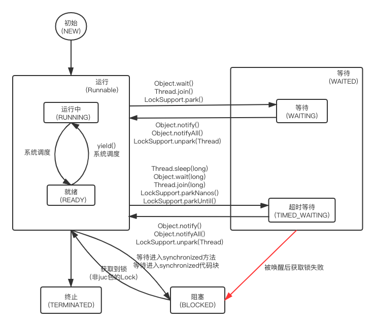

## Java线程的生命周期

Java线程的生命周期一共有5种不同的状态：

- NEW：初始状态。刚被创建，还没有执行start()方法。
- RUNNABLE：运行状态。由于JAVA的线程模型是一对一的内核级线程模型，所以线程内部实际还会有运行中和就绪两种状态，但从Java语言角度看统称为“运行态”。
- WAITED：等待状态。进入该状态表示**当前线程需要等待其他线程做出一些特定动作**，根据是否设置超时时间可以细分为“等待“和”超时等待“两种状态。
- BLOCKED：阻塞状态。表示**线程在获取锁的过程中失败被阻塞**。
- TREMINATED：终止状态。线程执行完毕。

## 2. Java线程状态变迁

java线程在自身的生命周期中会随着代码执行在不同的状态之间进行切换，其状态变迁如下图所示：

状态变迁主要可以分为以下几类：

- 初始 ==> 运行：创建好的线程调用start()方法进入运行状态
- 运行 ==> 终止：线程执行完run()方法后结束
- 运行 <==> 等待：当线程执行wait()方法或LockSupport的一些辅助方法， 会进入到等待状态。此时线程需要依靠其他线程通知才能返回到运行状态。**JUC包Lock接口的阻塞实现均使用了LockSupport类的相关方法，因此调用JUC包中Lock接口实际进入的是等待状态而非阻塞状态**。
- 运行 <==> 阻塞：线程在尝试进入synchronized关键字修饰的方法或代码块时获取锁失败会进入阻塞状态。

## 3. 等待态和阻塞态

在第二节里有一个状态没被提到：等待 ==> 阻塞。

其实实际情况下不会真的有这个状态的直接转换。**当一个线程从等待态退出时，会先进入运行态，再尝试获取锁，锁竞争失败后进入阻塞态**。该图特意用红色线画了一个"错误"的状态变迁是想提醒读者，等待态和阻塞态是两个完全不同的状态。

我们可以认为阻塞态是对锁的竞争，由JVM自动管理这些参与竞争的线程，当其中一个线程从临界区退出时，JVM会自动调度另一个竞争成功的线程进入临界区。而等待态则是一个线程需要等待另一个线程的通知，需要我们手动管理线程之间的通信。

## 4. 参考资料
[Java并发编程的艺术](https://book.douban.com/subject/26591326//)
[Java线程中等待态和阻塞态的区别](https://www.zhihu.com/question/27654579)