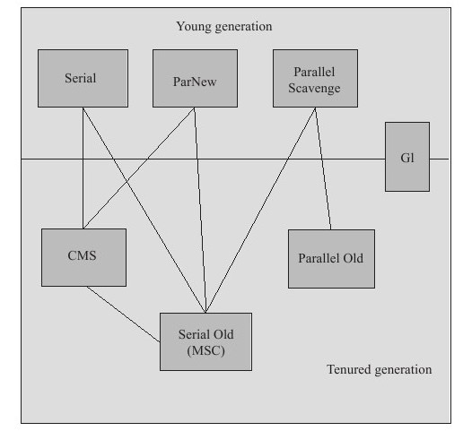

## GC算法

常用的GC算法有：

- 引用计数法：无法处理循环运用；
- 标记清除（mark-sweep）：会有stw；
- 标记压缩：在标记清除的基础上将剩余存活的对象放到一起
- 分代收集：将空间划分为新旧空间，每次将旧空间里存活的对象移到新空间里。

## [GC收集器](https://crowhawk.github.io/2017/08/15/jvm_3/)

基于JDK1.7 Update 14 之后的HotSpot虚拟机包含这7种GC收集器：

- 新生代：
    - Serial：**进行垃圾收集时，必须暂停其他所有的工作线程，直至Serial收集器收集结束为止（“Stop The World”）。单线程收集器，采用复制算法。**
    - ParNew：Serial收集器的多线程版本。
    - Parallel Scanvenge：一个并行的**多线程复制**算法的GC收集器，目标是**达到一个可控制的吞吐量**。
- 老生代：
    - CMS（Concurrent Mark Sweep）：一种以**获取最短回收停顿时间**为目标的收集器。分为以下四个步骤：
    
        - 初始标记：标记一下GC Roots能直接关联到的对象，需要STW（运行很快）；
        - 并发标记：进行**GC Roots Tracing**的过程，在整个过程中耗时最长；
        - 重新标记：对并发标记未被标记到的新对象进行标记，需要STW；
        - 并发清除；
    
        缺点：
    
        - 并发清除阶段产生的新垃圾无法及时清除；
        - 有很多内存碎片；
    
    - Serial Old（MSC）：Serial在老年代的收集器，使用**“标记-压缩”（Mark-Compact）**算法。作为CMS收集器的后备预案，在并发收集发生**Concurrent Mode Failure**时使用。
    
    - Parallel Old：Parallel Scavenge收集器的老年代版本，使用**多线程**和**“标记-压缩”**算法，适合**注重吞吐量**以及**CPU资源敏感**的场合。

#### G1收集器

HotSpot开发团队赋予它的使命是（在比较长期的）未来可以替换掉JDK 1.5中发布的CMS收集器。G1从整体来看是基于**“标记-整理”**算法实现的收集器，从局部（两个Region之间）上来看是基于**“复制”**算法实现的。

### 停顿时间和吞吐量

**停顿时间越短就越适合需要与用户交互的程序**，良好的响应速度能提升用户体验。

**高吞吐量**则可以**高效率地利用CPU时间**，尽快完成程序的运算任务，主要适合**在后台运算而不需要太多交互的任务**。