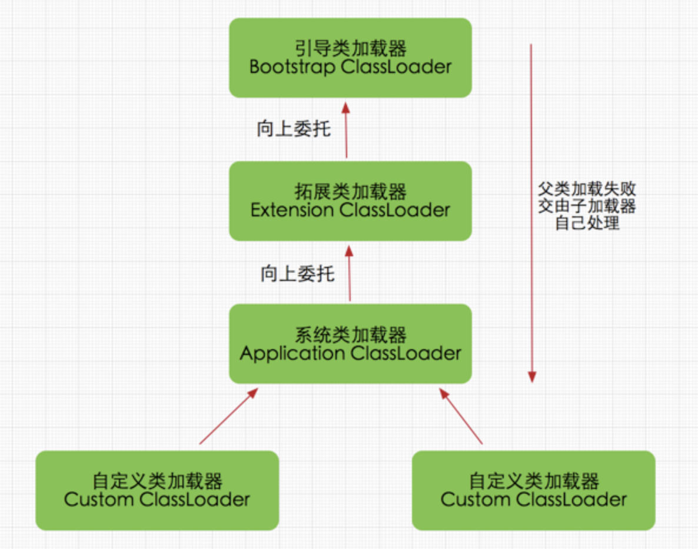

## 类的唯一性

Java 的任意一个类需要**类本身**和**加载该类的类加载器**共同确定其唯一性，即如果不同的类加载器去加载了同一份Class文件，得到的类也是不同的。

在JVM中表示两个class对象是否为同一个类对象存在两个必要条件

- 类的完整类名必须一致，包括包名。
- 加载这个类的ClassLoader(指**ClassLoader实例对象**)必须相同。

## Java类加载器种类

Java中主要存在三种类加载器：

- 引导类加载器（Bootstrap ClassLoader）：加载`${JAVA_HOME}$/lib`下的所有类，且名字要符合（**不符合规则的即使放到该目录下也不会加载**）。
- 拓展类加载器（Extension ClassLoader）：`ExtClassLoader`，`负责加载${JAVA_HOME}$/lib/ext`的类，开发者可以直接使用该类加载器。
- 系统类加载器（Application ClassLoader）：`AppClassLoader`，负责加载用户类路径上（classpath）的类，一般用户自定义的类都默认使用这个类加载器加载。

**其中引导类加载器，在C++中实现，是虚拟机自身一部分，其余类加载器都由Java实现，独立于虚拟机外部。**

## 双亲委派模型

java使用**双亲委派模型**加载类，当一个类加载器收到加载类的请求，先交给自己的父类去加载，父类加载失败再由自己来处理。双亲委派模型的类加载器之间的关系**以组合关系来实现而不是使用继承的方式**。

双亲委派模型有以下优势：

- **保证类的唯一性**：同一个类都会被同一个类加载器加载，不会出现同样的类在内存中有多个Class对象的情况
- **保证安全**：假设用户写了自定义的 `java.lang.Object` 类，通过双亲委派模型，顶层的引导类加载器可以检测出这一事实，并禁止加载。

双亲委派的具体逻辑实现在方法 `loadClass()` 中：

`loadClass()` 会做以下事情：

1. 检测该类是否已加载过
2. 若没有，则调用父加载器的 `loadClass()`
3. 如果父类加载失败抛出 **ClassNotFoundException** 异常，则调用自己的 `findClass()` 进行加载

注：**所以用户想要自定义类加载器应该重写 `findClass()` ，在这个方法里写入自己加载类的逻辑机制**，而保留 `loadClass()` 的双亲委派机制。

**双亲委派**结构如下：

## 四个比较重要的类加载方法

loadClass(String)：实现双亲委派模型，并调用 `findClass`。

findClass(String)：将字节码加载成流，调用 `defineClass`。

defineClass(byte[] b, int off, int len)：**将byte字节流解析成JVM能够识别的Class对象** ，通过这个方法不仅能够通过class文件实例化class对象，也可以通过其他方式实例化class对象，如通过网络接收一个类的字节码，然后转换为byte字节流创建对应的Class对象。

> (ClassLoader中已实现该方法逻辑)

如果直接调用defineClass()方法生成类的Class对象，这个类的Class对象**并没有解析(也可以理解为链接阶段，毕竟解析是链接的最后一步)**，其解析操作需要等待初始化阶段进行。

resolveClass(Class≺?≻ c)：使用该方法可以使用类的Class对象创建完成也同时被解析。前面我们说链接阶段主要是**对字节码进行验证，为类变量分配内存并设置初始值同时将字节码文件中的符号引用转换为直接引用**。

### [参考链接](https://blog.csdn.net/javazejian/article/details/73413292)