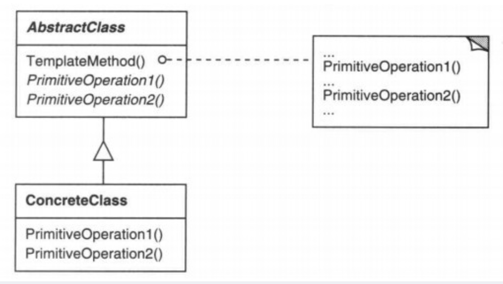

## 1. 基本概念

**行为型模式**，建立一个框架，对外提供一个服务接口，**将一些步骤实现延迟到子类**。

## 2. 应用场景

当有些类具有相同的行为步骤，但又有具体细节上的不同，我们就可以抽取其中一部分相同的行为，封装成父类的不变行为（final方法），将剩余的可变方法（abstract）留给子类实现。

## 3. 拓展

Java的AQS使用了模板方法的设计模式。

## 4. UML类图

