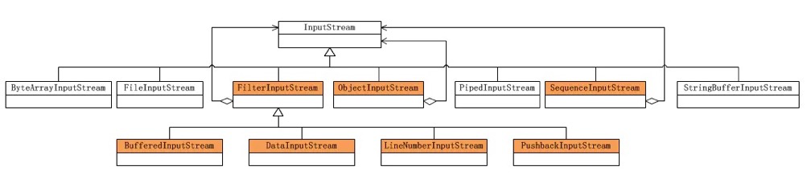

## 1. 基本概念

> ”尽量使用对象组合，而不是对象继承”

**结构型模式**，为对象增强功能，他可以避免继承的缺点（继承为类引入静态特征，每个子类功能是固定的，想要拓展又需要继承）。而**装饰器模式将装饰器和实际对象两部分进行了解耦**，一个装饰器可以装饰不同的具体对象，还可以给一个对象多次增加同一个装饰器，将对象继承转成了对象组合。

## 2. 应用场景

需要经常增强类的功能，但又不希望增加过多的子类。

优点：装饰器可以复用，且增强类变得灵活，可以根据装饰器的组合方式动态增强类；

缺点：当装饰器数量也变多后，或使用多层装饰器，会很复杂。

## 3. 拓展

- **抽象构建角色(Component)：**由`InputStream`扮演。这是一个抽象类，为各种子类型提供统一的接口。
- **具体构件角色(ConcreteComponent)：**由`ByteArrayInputStream`、`FileInputStream`、`StringBufferInputStream`等类扮演。它们实现了抽象构件角色所规定的接口。
- **抽象装饰角色(Decorator)：**由`FilterInputStream`、`ObectInputStream`等类扮演。它们实现了`InputStream`所规定的接口。
- **具体装饰角色(ConcreteDecorator)：**由几个类扮演，分别是`BufferedInputStream`、`DataInputStream`以及两个不常用到的类`LineNumberInputStream`、`PushbackInputStream`。

[参考资料](https://www.jianshu.com/p/d80b6b4b76fc)

## 4. UML类图

