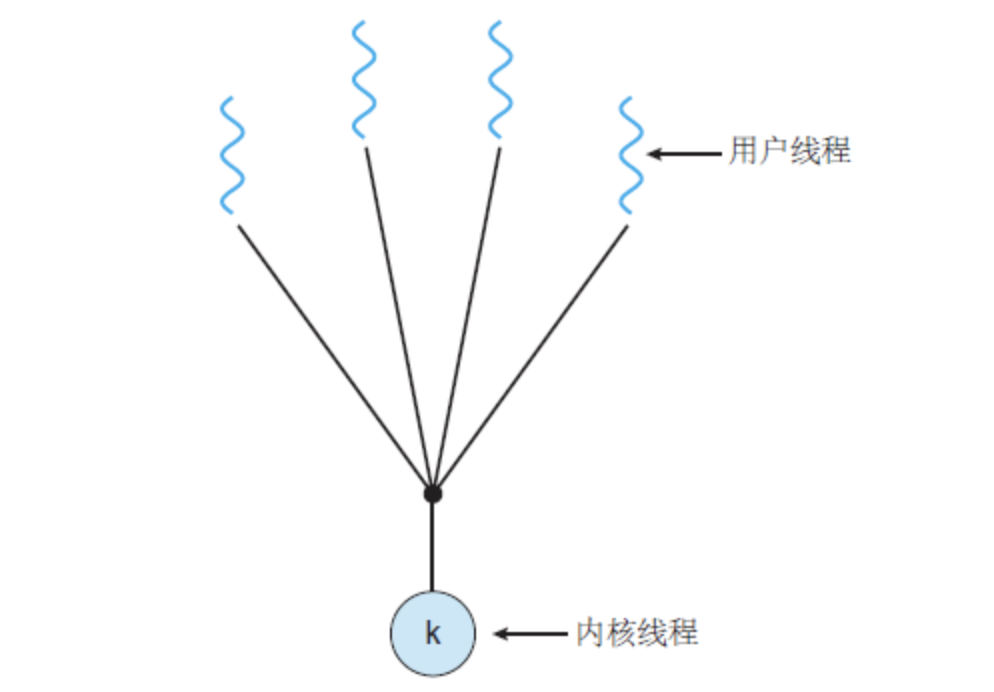
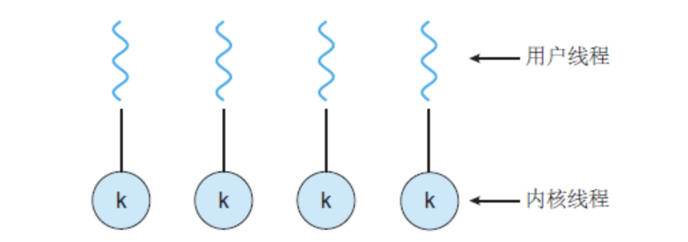
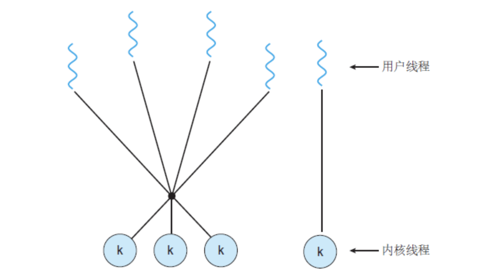

用户线程和内核线程的线程映射模型分为：

- 多对一
- 一对一
- 多对多

## 多对一模型

映射多个用户级线程到一个内核线程。

优点：多对一线程模型中，**线程的创建、调度、同步的所有细节全部由进程的用户空间线程库来处理**，内核态和用户态的切换不会过于频繁。

缺点：如果其中一个线程执行IO导致绑定的内核线程阻塞，则其他用户线程也都被阻塞了。内核线程挂掉之后，整个进程都挂掉了。

## 一对一模型

映射每个用户线程到一个内核线程。

优点：其中一个用户线程导致绑定的内核态线程阻塞时，其他用户线程仍可以被调度运行。

缺点：创建一个用户线程就要创建一个相应的内核线程。由于创建内核线程的开销会影响应用程序的性能，所以这种模型的大多数实现**限制了系统支持的线程数量**。且会有频繁的内核态用户态切换。

Linux，还有 Windows 操作系统的家族，都实现了一对一模型。

## 多对多模型

多路复用多个用户级线程到**同样数量或更少数量的内核线程**。

[多线程模型：一对一模型、多对一模型和多对多模型](http://c.biancheng.net/view/1220.html)

[历史上线程的3种实现模型](https://blog.csdn.net/Move_now/article/details/78615668)

