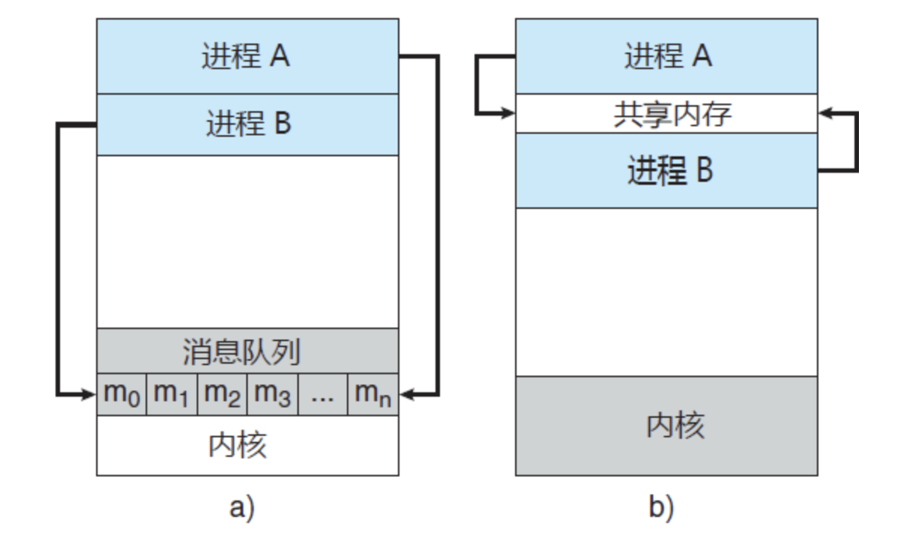

进程间高级通信有三种方式：

- 共享内存：存储器中划分了一块共享存储区，比如**剪切板**；

- 管道通信：连接读写进程以实现他们之间通信的共享文件（**pipe文件，类似先进先出的队列，由一个进程写，另一进程读，半双工**）管道分为：

    - 匿名管道：只能用于父子进程、兄弟进程之间通信；
    - 命名管道：可以用于毫无关联的进程间通信，与匿名管道不同，它以FIFO的形式存在于文件系统（硬盘）中；

    管道都是半双工通信，**管道是单向的、先进先出的、无结构的、固定大小的字节流，它把一个进程的标准输出和另一个进程的标准输入连接在一起**

- 消息队列：相比于管道通信，消息队列的优势在于，它独立于发送和接收进程而存在。**多个进程可以对同一个消息队列收发消息**，且可以限制消息格式。**消息队列克服了信号传递信息少、管道只能承载无格式字节流以及缓冲区大小受限等缺点**。

其余还有：

1. **信号量（semaphore）**：主要作为进程间以及同一进程不同线程之间的同步手段。
2. **套接口（Socket）**：更为一般的进程间通信机制，可用于不同机器之间的进程间通信。起初是由Unix系统的BSD分支开发出来的，但现在一般可以移植到其它类Unix系统上：Linux和System V的变种都支持套接字。
3. **信号（Signal）**：信号是比较复杂的通信方式，用于通知接受进程有某种事件发生，除了用于进程间通信外，进程还可以发送信号给进程本身；linux除了支持Unix早期信号语义函数sigal外，还支持语义符合Posix.1标准的信号函数sigaction（实际上，该函数是基于BSD的，BSD为了实现可靠信号机制，又能够统一对外接口，用sigaction函数重新实现了signal函数）；

等等

[线程和进程通信](https://segmentfault.com/a/1190000008732448)

