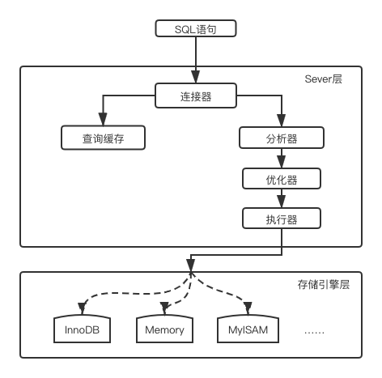

## 一条SQL语句的执行生命周期

MYSQL从宏观角度的架构可以分为两层：

- 存储引擎层：负责数据的读取和存储，目前最常使用的存储引擎是Innodb，MYSQL的存储引擎以一种插件式的方式接入系统。
- Sever层：负责所有跨存储引擎的功能，包括视图、语法分析、索引选择等。

一条SQL语句经历的具体过程如下：

1. 通过连接器连接到数据库上；
2. 如果有缓存（由于缓存利大于弊，新版本的MYSQL已删除缓存功能），则查询缓存，否则直接进入第三步；
3. 对SQL语句进行词法分析、语法分析，在这一步会**判断SQL语句是否符合规定的语法规则**（解析器），以及**判断涉及到的表名、列名等是否存在**（预处理器）；
4. 对SQL语句进行优化，比如多个条件查询时如何选择索引，如何选择表联结等；
5. 开始执行SQL语句，这里包括一些权限检查。

SQL执行过程图如下：

## 拓展

为什么缓存利大于弊？

因为表更新频繁时，缓存容易失效，当我们对一个表进行更新时，与这些相关的缓存都要失效清空。

