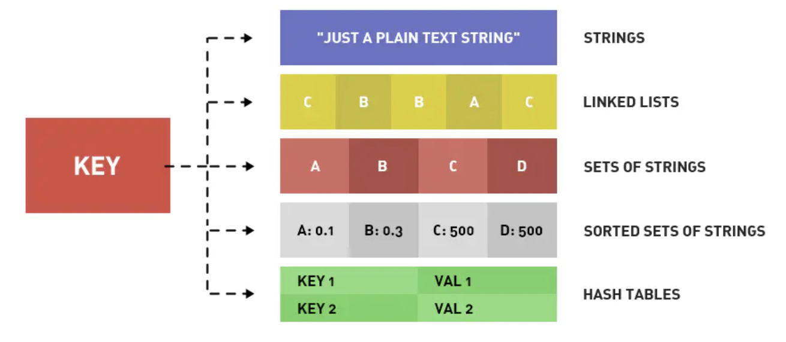
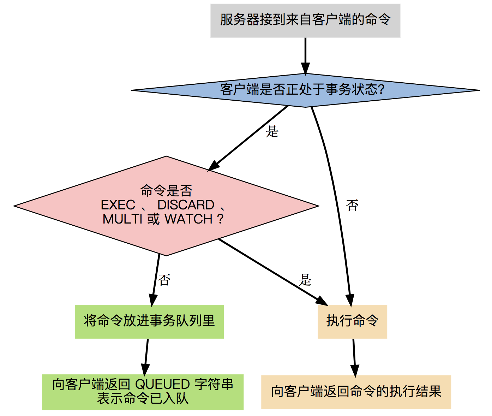

redis是一种内存数据库、nosql数据库、kv数据库，它支持多种数据结构，运行速度快。

## 数据结构

redis支持的数据结构有：

- string：`set k v`， 如`set name dongjianhui`，`get`；
- hash：`hset k1 v1 k2 v2...`，如`set hash001 key1 value1 key2 value2`，`hget`；
- list：双向链表，可以添加一个元素到列表的头部（左边）或者尾部（右边）。`lpush k v`和`push k v`；
- set： string 类型的无序集合，用哈希表实现，插入、寻找、删除都是O(1)。`sadd k v`；
- zset（sorted set）：有序set，每个元素会绑定一个double类型的分数，根据分数排序，`zadd k v`，添加元素到集合，元素在集合中存在则更新对应score。

## 事务

redis的事务不是原子性的，也不会回退，假设事务中有一条命令执行失败，会继续执行事务中的下一条命令。

一个事务从开始到执行会经历以下三个阶段：

1. 开始事务（MULTI）。
2. 命令入队。
3. 执行事务（EXEC)。

事务队列其实是一个数组，每个数组项包含三部分：

1. 要执行的命令（cmd）；
2. 命令的参数（argv）；
3. 命令参数的个数（argc）。

**[redis设计与实现](https://redisbook.readthedocs.io/en/latest/feature/transaction.html)**

## 常用命令

`config get dir`：获得redis安装目录。

