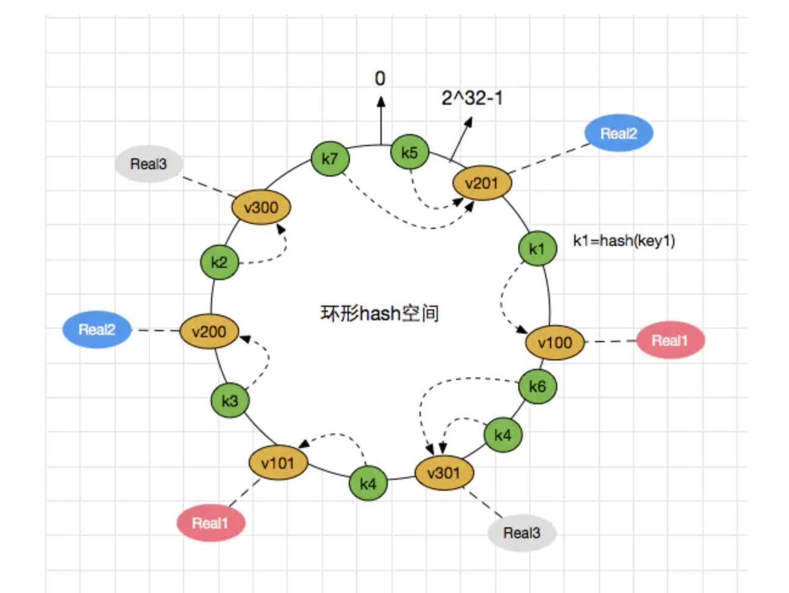

## 一致性hash

一致性哈希用于解决分布式缓存系统中的以下一些问题：

- 数据选择节点存储问题
- 数据选择节点读取问题
- 增删节点后减少数据缓存的消失范畴，防止雪崩的发生

一致性hash是一个**0-2^32**的闭合圆，具体的存储流程如下：

1. 对节点进行hash计算（如使用ip），并分配在这个圆上；
2. 对要存储的key进行hash(key)，将hash后的值分布在这个圆上；
3. 顺时针找到一台最近的机器，存储在该机器上；

一致性hash会有以下两个问题：

1. **连续雪崩**：假设当中有一套服务器宕机了，则这些缓存的数据会流到最近的下一台顺时针机器上，可能造成下一台机器水位过高，同样崩溃；
2. **数据倾斜**：可能会出现某块区域数据较多，都集中在一台服务器上；

#### 

为了解决这两个问题，一致性hash引入了虚拟节点的概念，每个物理机**有多个虚拟节点**分布在圆上，如图所示：

## 哈希槽

redis cluster采用数据分片的**哈希槽**来进行数据存储和数据的读取。

redis cluster一共有2^14（16384）个槽，而每个master节点负责当中的一部分（如1—100）个槽，每个master节点下还有一些slave节点，用于在master节点宕机时进行替换。

节点宕机时一致性hash使用数据转移的方式，而哈希槽使用slave后备节点替换，但这样哈希槽仍无法处理连续雪崩的问题。