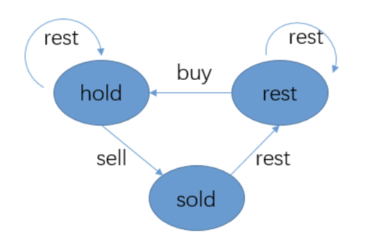

## 股票（通解：含后效性的DP）


### 

### [最佳买卖股票时机包含冷却期](https://leetcode-cn.com/problems/best-time-to-buy-and-sell-stock-with-cooldown/)

每天可能存在三种状态：

- hold：继续持有股票
- sold：卖出股票
- rest：什么都不做

转换关系如下：



```c++
class Solution {
public:
    int maxProfit(vector<int>& prices) {
        int sold = 0, rest = 0, hold = INT_MIN;
        for (int p : prices) {
            int pre_sold = sold;
            sold = hold + p;
            hold = max(hold, rest - p);
            rest = max(rest, pre_sold);
        }
        return max(sold, rest);
    }
};
```

